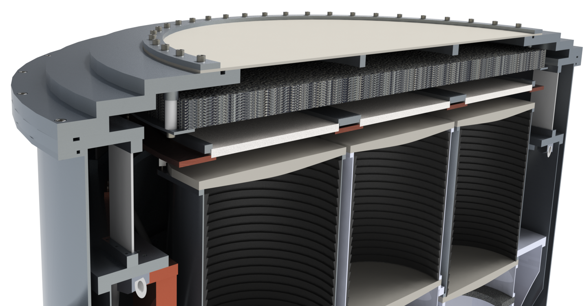
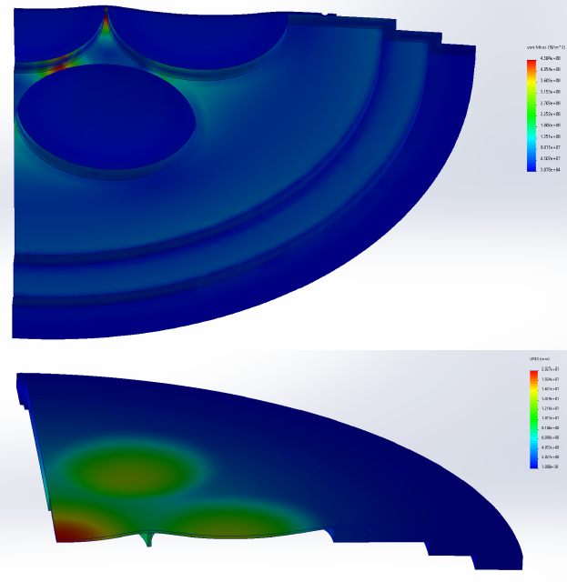
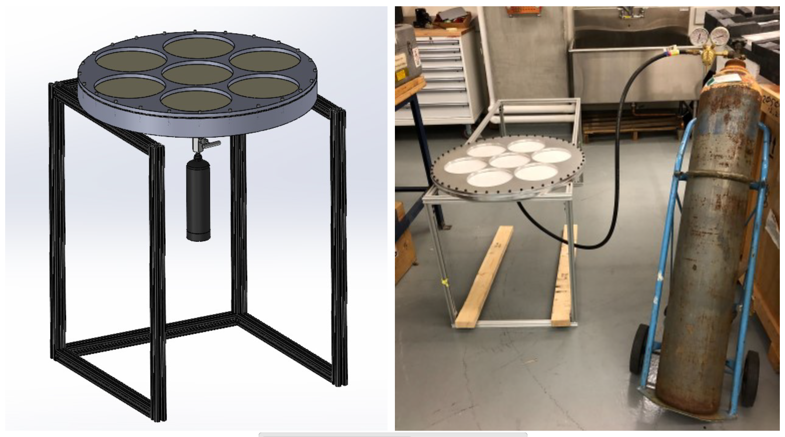
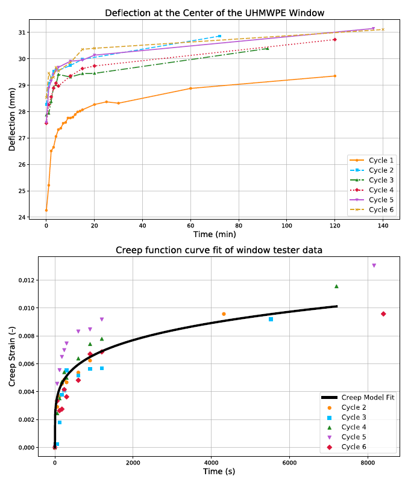

# SPT-4-Vacuum-Window-Prototype
The prototype assembly and creep deflection tests of the Ultra-high molecular weight polyethylene (UHMWPE) vacuum window. I performed the creep deflection modeling and prototyping of this window for a thickness of 3 millimeters, which was chosen to minimize excess optical loading on the focal plane from the small (~1%) level absorption of UHMWPE at millimeter wavelengths. SPT-3G used a 10 millimeter thick High-density Polyethylene (HDPE) window, and we were unsure how the thinner material would behave when subjected to vacuum pressure.

  

I calculated the initial deflection using thin plate theory, which necessitated adding an aluminum stiffening plate below the window with seven aperture cutouts. I defined a static FEA for the quarter-symmetry window assembly subjected to atmospheric pressure. The circumference was constrained by a bolt sandwich with a pre-torque of 80 N-m (wrench tight). The bottom face of the subassembly is fixed as it abuts the axis of the cylinder which is quite stiff.

The FEA predicted a maximum deflection of 22.03 millimeters. I absorbed this using G10 shims on the Zotefoam IR filter stack to increase the spacing. Further there was some yielding in the aluminum stiffening plate between the aperture holes, but we do not think it will be an issue since a little plastic deformation won't compromise it's purpose.

  

The story is complicated by the creep properties of UHMWPE. This behavior is well-understood in the field of prosthetics, but we were unsure how this would affect this design. To gain an understanding of the deflection behavior as a function of time, I designed and built an in-lab prototype window assembly using positive pressure instead of vacuum to minimize the material used. The positive pressure was added with compressed nitrogen and a pressure regulator with the appropriate NPT-threaded valve interfaces. 

  

I then performed deflection measurements as a function of time for 7 cycles (or when the cylinder ran out). I converted the deflection to strain using geometric arguments. Fitting this data to a creep model then allowed me to build an understanding of the time-dependent behavior.

  

I tried to build a more detailed FEA from this information, but was unable to get the analysis to converge. It was realized at this point that the deflection was simply too great and there was no reasonable design parameter space that accomodated it. Instead of beating our heads against the wall to make it work, we elected to replace UHMWPE with HDPE at 10 millimeters thick and compensate for the increased optical load with additional infrared filtering.

## My Role:
- Led design, collaborating with Optics team on design constraints
- Performed hand calculations using thin plate theory and finite element analysis with both static and time-dependent material properties
- Designed and built prototype subassembly
- Conducted deflection measurements with time using the prototype assembly

## Design Constraints:
- 99 millimeters of space between the vacuum window and the first lens
- 10 sheet (3 millimeters thick) Zotefoam stack of infrared filters
- 1 alumina disk (10 millimeters thick) mounted to the 50 Kelvin subassembly
- failure occurs when the vacuum window touches the optics stack (<28 millimeters of deflection)

## Summary of Results:
- deflections are too high and a thicker window is needed
- more IR filtering compensates the higher optical load from the 10 millimeter thick HDPE window

## Files:
